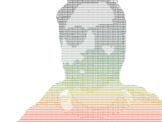
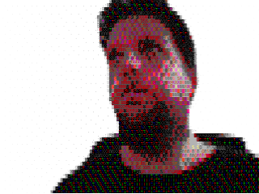

# Ascii Virtual Camera

Well, MS Teams dont have filters... so i implement my own. 

# Procedure

1) Get input from camera  

2) Get mask using Deeplab segmentation  

3) Erode the mask  

4) Input + Mask  

5) Output   

6) Output w/libcaca  

Result:   

# References

[Virtual Background](https://elder.dev/posts/open-source-virtual-background/)

[ASCII Art](https://wshanshan.github.io/python/asciiart/)

[Deeplab Model](https://github.com/tensorflow/models/blob/master/research/deeplab/g3doc/model_zoo.md)

# Preparing Enviroment
    
Install conda

    wget https://repo.anaconda.com/miniconda/Miniconda3-latest-Linux-x86_64.sh
    bash Miniconda3-latest-Linux-x86_64.sh
    bash

Install dependencies

    sudo apt install v4l2loopback-dkms libcaca0
    conda install tensorflow-gpu opencv pillow  
    pip install pyfakewebcam colour

# Run

    sudo apt install v4l2loopback-dkms
    sudo modprobe -r v4l2loopback
    sudo modprobe v4l2loopback devices=1 video_nr=20 card_label="v4l2loopback" exclusive_caps=1
    
    python main.py

# Options

    usage: main.py [-h] [-vh HEIGHT] [-vw WIDTH] [-wc WEBCAM] [-fc FAKEWEBCAM]
                   [-p PIXELSCALE] [-c CONTRAST] [-u [USECACA]]
    
    optional arguments:
      -h, --help            show this help message and exit
      -vh HEIGHT, --height HEIGHT
                            Video height (default 640)
      -vw WIDTH, --width WIDTH
                            Video width (default 480)
      -wc WEBCAM, --webcam WEBCAM
                            Webcam device (default /dev/video0)
      -fc FAKEWEBCAM, --fakewebcam FAKEWEBCAM
                            Fake Webcam device (default /dev/video20)
      -p PIXELSCALE, --pixelscale PIXELSCALE
                            Pixel scale (default 0.15)
      -c CONTRAST, --contrast CONTRAST
                            Contrast adjustment (default 1)
      -u [USECACA], --usecaca [USECACA]
                            Use libcaca for ASCII transformation
      -bg BACKGROUND, --background BACKGROUND
                            Background image path
